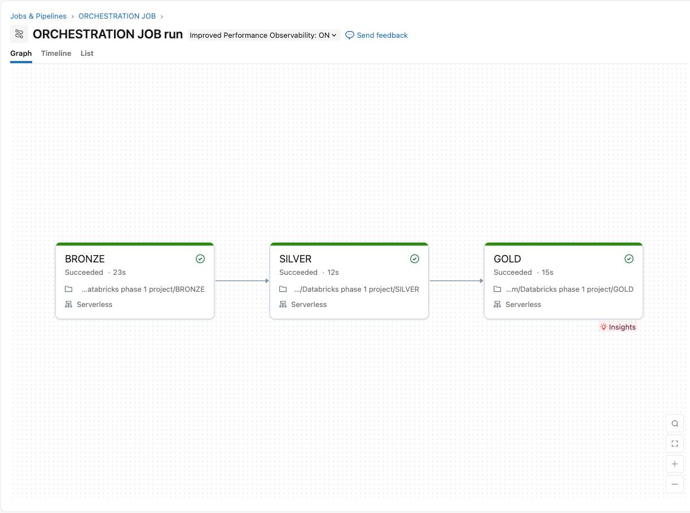

# Snowflake to Databricks Medallion Pipeline

This project moves order data from Snowflake into Databricks and processes it through a Bronze/Silver/Gold layered architecture, orchestrated as a scheduled job. It is meant to showcase the skills involved in building this kind of pipeline, not to be a production system.

## Architecture

Snowflake (source) -> Databricks (Bronze -> Silver -> Gold) -> Amazon S3 (planned target)

- Source: order data from a Snowflake table (srctab)
- Processing: Databricks notebooks using PySpark and Delta tables
- Output: a partitioned Gold table, meant to be written to an S3 directory

## What each layer does

### Bronze
- Creates the catalog, schema, and volume
- Connects to Snowflake using the Spark Snowflake connector
- Pulls the required columns (order_id, order_date, customer_id, region, product_name, unit_price, quantity) and writes them as parquet
- Loads that parquet data into a bronze_orders table, no transformations yet

### Silver
- Reads from bronze_orders
- Casts unit_price to decimal(12,2) and quantity to integer
- Adds a new column, order_amount, calculated as unit_price times quantity
- Writes the result to silver_orders

### Gold
- Reads from silver_orders
- Pulls out order_year and order_month from order_date
- Writes to gold_orders, partitioned by year and month

## Orchestration

The pipeline runs as a Databricks Job called ORCHESTRATION JOB, with three tasks that run in order: Bronze, then Silver, then Gold. Each task runs on serverless compute, and each one waits for the previous task to finish successfully before starting. This way Silver never runs on incomplete Bronze data, and Gold never runs on incomplete Silver data.

Here is a screenshot of a successful run:



## Handling credentials

The Snowflake username and password are not hardcoded in the notebook. Instead they are stored in a Databricks secret scope and pulled in when the code runs:

```python
sf_user = dbutils.secrets.get(scope="snowflake-creds", key="sf-user")
sf_password = dbutils.secrets.get(scope="snowflake-creds", key="sf-password")
```

This keeps the actual credentials out of the code and out of GitHub.

## About S3

The Gold table is set up to be written to Amazon S3, it is already partitioned by year and month, ready for that. As a student, I did not actually connect S3 for this project because that would need a real AWS account and would start costing money, and I did not want to spend money on a practice project. The pipeline code itself would not need to change much to add S3, just the output path.

## Tools used

- Snowflake for the source data
- Databricks (PySpark, Delta Lake, Unity Catalog) for the pipeline and orchestration
- Amazon S3, planned but not connected yet
